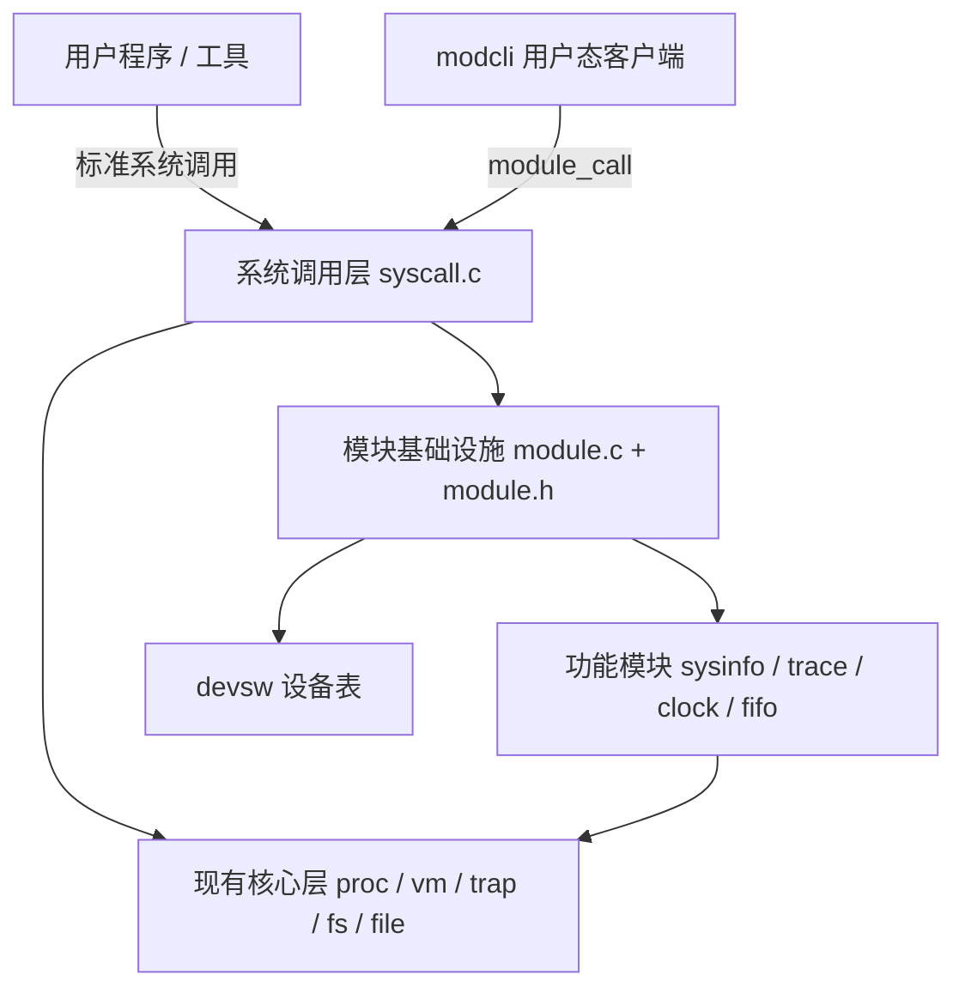

# xv6-riscv 模块拓展架构方案

> 目标：在不重写现有核心代码的前提下，为 xv6-riscv 增加“模块拓展层”，
> 让后续新增功能尽量变成“新增独立文件 + 注册”，而不是修改已有模块。

## 1. 约束与前提

xv6 是单体、静态链接的教学内核，不支持 Linux 那种运行时加载模块。
因此“模块化”必须采用编译期模块化：

- 模块代码在编译时链接进内核镜像；
- 模块通过注册表暴露初始化、系统调用、设备或事件钩子；
- 内核核心尽量作为稳定平台，不随功能模块反复修改；
- 允许一次性的少量“接线”改动，但之后新增模块应该是新增文件为主。

完全零改动是不现实的。任何新功能只要进入内核，至少需要一个注册入口。
我们的目标是把这种改动收敛到一次性的模块基础设施上。

## 2. 现有可复用的扩展点

xv6 已经存在一些天然扩展点，设计方案应该优先利用它们：

| 扩展点 | 现有实现 | 适用方向 |
|---|---|---|
| `devsw[]` | [kernel/file.h](/Users/a1-6/Documents/linux/xv6-riscv/kernel/file.h) 中的设备读写函数表 | 伪设备、字符设备 |
| `syscalls[]` | [kernel/syscall.c](/Users/a1-6/Documents/linux/xv6-riscv/kernel/syscall.c) 的系统调用表 | 新系统调用 |
| `defs.h` | 全内核函数声明 | 模块 API 的公共出口 |
| `Makefile OBJS/UPROGS` | 内核对象与用户程序列表 | 编译期模块装配 |
| `main.c` 初始化序列 | 内核启动初始化 | 模块初始化入口 |
| `usys.pl / user.h` | 用户态系统调用封装 | 新系统调用的用户侧接口 |

## 3. 总体分层



设计原则：

1. 现有核心代码是“平台层”，功能模块是“扩展层”。
2. 模块之间不直接互相调用，统一通过模块基础设施访问。
3. 模块可以调用核心 API，但核心不能反向依赖具体模块。
4. 新模块尽量通过注册表接入，而不是修改已有分支逻辑。

## 4. 候选架构方案

### 方案 A：模块描述符注册表

这是最接近 Linux `module_init()` 的静态版本。

每个模块定义一个描述符：

```c
struct kmod {
  const char *name;
  int priority;
  int (*init)(void);
  int (*deinit)(void);
};
```

模块文件底部注册：

```c
#include "module.h"

static int sysinfo_init(void) { ... }

MODULE_REGISTER(sysinfo, sysinfo_init, 0, 0);
```

模块描述符可以放在专用链接段 `.kmods` 中，内核启动时统一遍历并调用 `init`：

```c
extern struct kmod __kmods_start[], __kmods_end[];

void module_init_all(void) {
  for (struct kmod *m = __kmods_start; m < __kmods_end; m++) {
    if (m->init) m->init();
  }
}
```

链接脚本增加：

```ld
.kmods : {
  __kmods_start = .;
  KEEP(*(.kmods))
  __kmods_end = .;
}
```

优点：

- 新增模块只需增加文件，不需要改模块注册中心；
- 启动初始化顺序通过 `priority` 控制；
- 有清晰的插件式结构。

缺点：

- 需要一次性改 `kernel.ld` 和 `Makefile`；
- 链接段方案比普通数组稍难调试。

### 方案 B：通用系统调用复用器 `module_call`

这是企业架构中常见的“门面模式”：只暴露一个稳定入口，内部再做分发。

新增一个系统调用：

```c
int module_call(int module_id, int cmd, uint64 arg0, uint64 arg1);
```

模块注册自己的命令处理器：

```c
struct sysmod {
  int id;
  const char *name;
  int (*handle)(int cmd, uint64 arg0, uint64 arg1, uint64 *ret);
};
```

例如：

```c
MODULE_SYSREG(sysinfo, 1, sysinfo_handler);
MODULE_SYSREG(trace, 2, trace_handler);
```

用户态调用：

```c
module_call(1, SYSINFO_GET_MEM, 0, 0);
module_call(2, TRACE_ON, 0, 0);
```

优点：

- 后续新功能不需要反复新增系统调用编号；
- 用户态 API 非常稳定；
- 非常适合 sysinfo、strace、调试接口这类功能。

缺点：

- 所有模块共用一个入口，参数语义需要模块自行定义；
- 需要统一维护模块 ID，避免冲突。

### 方案 C：事件钩子机制

在内核几个关键路径上提供钩子，模块订阅感兴趣的事件：

```c
struct kmod_hooks {
  void (*tick)(void);
  void (*syscall_enter)(int num);
  void (*syscall_exit)(int num, uint64 ret);
  void (*proc_fork)(struct proc *child);
  void (*proc_exit)(struct proc *p);
};
```

模块注册：

```c
static struct kmod_hooks trace_hooks = {
  .syscall_enter = trace_enter,
  .syscall_exit = trace_exit,
};

MODULE_HOOK(trace, &trace_hooks);
```

适合：

- strace 系统调用追踪；
- 调度统计；
- 崩溃转储；
- 性能计数。

代价：

- 需要在 `scheduler()`、`usertrap()`、`syscall()` 等位置增加少量钩子调用；
- 钩子执行时必须考虑中断状态和锁约束；
- 钩子不能睡眠，否则可能破坏内核执行流。

### 方案 D：设备与伪文件模型

xv6 已经有 `devsw[]` 设备表。可以把它升级成模块注册模型。

模块注册一个字符设备：

```c
struct kmod_device {
  int major;
  const char *name;
  int (*read)(int user_dst, uint64 dst, int n);
  int (*write)(int user_src, uint64 src, int n);
};
```

模块初始化时写入 `devsw[major]`，并在文件系统中创建设备节点。

适合：

- `/dev/sysinfo`；
- `/dev/clock`；
- `/dev/trace`；
- 后续的 FIFO、共享内存等伪设备。

优点：

- 复用现有文件描述符机制；
- 用户程序用普通 `read/write/open` 访问；
- 对 `file.c` 几乎零侵入。

需要控制的风险：

- `NDEV` 当前较小，可能需要扩大到 16 或更多；
- 设备节点需要放进 `fs.img` 或由 `init` 动态创建。

### 方案 E：用户态服务框架

不是所有功能都需要进内核。可以建立一个用户态服务层：

- `user/service.c`：常驻服务进程；
- `user/modcli.c`：客户端；
- 服务协议通过管道或 FIFO 通信。

适合：

- shell 增强；
- 状态展示；
- 外部命令扩展；
- 不涉及特权操作的业务功能。

优点：

- 对内核零改动；
- 开发、调试、替换都更安全。

缺点：

- 无法访问内核内部数据结构；
- 通信需要额外协议和进程管理。

### 方案 F：远期动态模块加载

可以把未来目标设计成 ELF 可重定位内核模块，但短期不建议实现。

需要解决：

- 内核符号表导出；
- 模块重定位；
- 模块内存权限；
- 符号冲突与版本管理；
- 卸载时的资源清理。

对 xv6 来说，动态加载会严重破坏教学简洁性，收益不高。

## 5. 推荐组合方案

建议采用“A + B + D”的组合：

1. 用方案 A 建立模块描述符与初始化注册表；
2. 用方案 B 建立统一的 `module_call` 系统调用入口；
3. 用方案 D 为需要文件接口的功能提供伪设备；
4. 用户态工具通过 `module_call` 和设备文件访问模块功能；
5. strace 类功能在后续再引入方案 C 的事件钩子。

这样可以把“一次性接线”收敛到少数文件，之后的新模块基本是：

```text
新增 kernel/modules/xxx.c
新增 user/xxx.c
注册模块描述符
注册 module_call 命令
完成
```

## 6. 一次性改动清单

以下改动是搭建模块基础设施时必须的，之后不再重复：

| 文件 | 改动 |
|---|---|
| `Makefile` | 自动扫描 `kernel/modules/*.c`，加入 `OBJS`；自动扫描 `user/modules/*.c`，加入 `UPROGS` |
| `kernel/kernel.ld` | 增加 `.kmods` 段 |
| `kernel/module.h` | 定义 `struct kmod`、`struct sysmod`、注册宏 |
| `kernel/module.c` | 模块描述符遍历、`module_call` 分发、设备注册 |
| `kernel/main.c` | 增加一次 `module_init_all()` |
| `kernel/syscall.h` | 增加 `SYS_module_call` |
| `kernel/syscall.c` | 在系统调用表增加一个入口 |
| `user/user.h` | 增加 `module_call()` 声明 |
| `user/usys.pl` | 增加 `module_call` 汇编桩 |

这些是一次性“平台建设”，不是每个功能模块都要重复改。

## 7. 模块目录建议

```text
kernel/
  module/
    module.h
    module.c
  modules/
    sysinfo.c
    trace.c
    clock.c
    fifo.c
    ...
user/
  modcli.c
  modules/
    sysinfo.c
    trace.c
    ...
```

模块 ID 统一维护：

```c
#define KMOD_SYSINFO  1
#define KMOD_TRACE    2
#define KMOD_CLOCK    3
#define KMOD_FIFO     4
```

## 8. 与开源项目经验的对照

| 项目 | 可借鉴经验 |
|---|---|
| Linux | `module_init`、`file_operations`、sysfs 设备模型 |
| Zephyr | 静态驱动注册、devicetree、编译期模块装配 |
| RT-Thread | 设备模型、组件自动初始化机制 |
| FreeBSD | 内核模块 ABI，但复杂度不适合 xv6 |
| DPDK | 插件式 PMD 驱动注册，接口稳定 |

xv6 最合适的学习对象不是 Linux 的动态模块，而是 Zephyr 和 RT-Thread 这类
“静态注册 + 设备模型”的嵌入式系统架构。

## 9. 推荐落地阶段

### 阶段一：模块基础设施

实现 `module.h`、`module.c`、`.kmods` 链接段、Makefile 自动扫描。

验收标准：

- 新增一个空模块，不需要改 `OBJS`；
- 模块 `init` 能自动执行；
- 模块描述符顺序可控。

### 阶段二：`module_call` 系统调用

实现通用系统调用入口和用户态 `modcli`。

验收标准：

- 用户程序可以调用 `module_call(1, ...)`；
- 新增模块命令不需要再改 `syscall.c`。

### 阶段三：示例模块

实现 `sysinfo`：

- 返回进程数；
- 返回空闲物理页；
- 返回系统启动后的 ticks；
- 返回当前模块列表。

这个模块可以作为后续所有模块的模板。

### 阶段四：伪设备

把 `sysinfo` 扩展为 `/dev/sysinfo`，支持用户态 `read/write`。

### 阶段五：钩子机制

在系统调用和调度路径增加少量钩子，实现 `strace`。

## 10. 模块开发规范建议

1. 模块命名使用 `kmod_` 前缀，例如 `kmod_sysinfo_init`。
2. 模块 ID 在 `module_ids.h` 集中登记。
3. 模块代码只允许通过 `defs.h` 和 `module.h` 访问核心 API。
4. 模块不直接修改 `struct proc`、`struct inode` 等核心结构；
   确需扩展时，把扩展数据放到模块自己的注册表或映射结构中。
5. 每个模块必须有独立用户态测试或 `usertests` 用例。
6. 每个模块配一个简短设计文档，说明命令 ID、参数、返回值。
7. 初始化失败时返回错误码，由 `module_init_all()` 汇总打印，而不是直接 panic。

## 11. 风险与对策

| 风险 | 对策 |
|---|---|
| 链接段注册表不可用 | 可退化为显式注册表数组，只改 `module_registry.c` |
| 模块初始化顺序问题 | `kmod.priority` 排序，依赖模块提高优先级 |
| 钩子持锁或中断上下文限制 | 文档明确“钩子不得睡眠”，必要时使用 deferred work |
| 模块 ID 冲突 | 集中维护 `module_ids.h` |
| `NDEV` 不足 | 在 `param.h` 中扩大设备号范围 |
| 模块代码污染核心逻辑 | 强制模块只能通过注册表接入 |
| 未来想动态加载 | 先固定 `struct kmod` ABI，保留扩展空间 |

## 12. 总结

xv6 不能做到 Linux 那样的动态模块加载，但完全可以做到“编译期模块化 + 注册表驱动”。

最务实的路线是：

1. 搭建 `module.h/module.c` 基础设施；
2. 提供通用 `module_call` 系统调用；
3. 复用 `devsw[]` 提供设备式接口；
4. 用 `sysinfo` 作为第一个示范模块。

完成这四步后，后续新增功能的主要工作就是“写模块、注册、写用户程序”，
而不是反复改写核心内核。

## 13. 当前落地状态

以下内容已经实现并通过构建与 QEMU 运行验证：

- 模块基础设施：`kernel/module/module.h`、`kernel/module/module.c`
- 链接段注册表：`.kmods` 与 `.kmod_sys`
- Makefile 自动收集 `kernel/module/*.c` 和 `kernel/modules/*.c`
- 通用系统调用 `SYS_module_call` 与用户态 `module_call()`
- 示例模块 `sysinfo`：`modcli 1 1`、`modcli 1 2`、`modcli 1 3`
- 事件钩子机制：tick、syscall enter/exit、proc fork/exit
- 基于 `devsw[]` 的模块设备注册 API
- `devsw` 完整文件操作接口：open/read/write/close
- 示例模块 `trace`：`modcli 2 1`、`modcli 2 2`、`modcli 2 3` 等
- 伪设备节点 `/sysinfo`：`cat sysinfo` 可直接读取系统信息
- 用户态模块目录自动扫描：`user/modules/*.c` 自动生成 `user/_*`
- 示例用户模块 `hello`：`user/modules/hello.c`
- 动态模块加载：`modload dynmod` / `modunload`
- 用户态工具 `user/modcli.c`
- P0 工具：`strace`、`perf`、`prio`、`procinfo`
- 进程优先级调度与 `setpriority`
- 符号链接 `T_SYMLINK` 与 `ln -s`
- shell `&&` 短路执行
- 伪设备 `/dev/stats`

尚未落地：

- 完整 ELF 重定位与内核符号解析
- 动态模块卸载回调
- 多个动态模块同时加载

## 14. 动态模块加载说明

当前实现是教学级动态加载器，采用自定义 flat 格式：

1. 动态模块链接到固定地址 `DYNMOD_BASE`；
2. 模块二进制通过 `objcopy -O binary` 生成；
3. 用户程序 `modload` 读取文件并调用 `module_load` 系统调用；
4. 内核把二进制复制到预留且可执行的内存区域；
5. 加载器以 `struct kmod_api *` 调用 `module_entry()`；
6. 模块通过 API 函数指针注册 `module_call` 处理器；
7. `modunload` 清除动态注册表并清空模块区域。

示例命令：

```text
modload dynmod
modcli 3 1
modunload
```

已知限制：

- 不解析 ELF 重定位，不解析内核符号；
- 动态模块只能通过 `struct kmod_api` 访问内核功能；
- 同时只支持一个动态模块；
- 模块不能使用未初始化的 BSS；
- 卸载时没有模块级 deinit 回调。

当前新增一个内核模块的流程是：

1. 新建 `kernel/modules/xxx.c`；
2. 包含 `module.h` 和 `module_ids.h`；
3. 实现 `KMOD_SYSREG` 或 `KMOD_REGISTER`；
4. 重新构建即可，无需修改 `OBJS`。
